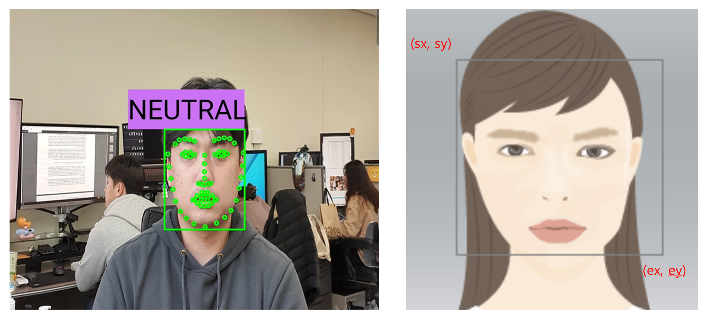
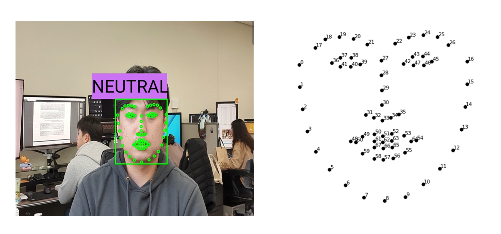

# FaceTool (android app)

## **Build Instructions**

This project based on [3DDFA Method](https://github.com/cleardusk/3DDFA) and [Ultra-Light-Fast-Generic-Face-Detector-1MB](https://github.com/Linzaer/Ultra-Light-Fast-Generic-Face-Detector-1MB).

### Required SDK, NDK version

- Android SDK 21~30
- Android NDK r21d
- Need to install CMAKE in Android Studio's "SDK tools"

Open the local.properties file in the project and set ndk.dir to the Android NDK folder path.

```
sdk.dir = /Users/Name/Library/Android/sdk
ndk.dir = /Users/Name/Documents/Android/android-ndk-r21d
```

This project has been tested on the Galaxy s10 5G.

## **How to Use**

### facedetector: Face ROI detection

The "facedetector.onnx" that detects the face ROI in image (input image resolution: 320 x 240, output result: Vector<Vector<Float>> boxes)



1. "facedetector.onnx" Loading and creating a model

```java
private Inference face_detector// MainActivity

protected void onCreate(Bundle savedInstanceState) {

...

// Receives the absolute path of the model file in the assets folder through the assetFilePath function
String face_detector_path = new File(assetFilePath(this, "facedetector.onnx")).getAbsolutePath();
// Inference instance creation of facedetector.onnx model (a face detection model is created and defined through JNI.)
//public Inference(String model_path, // 모델 절대경로
//                 int img_height, // 모델 입력해상도 높이
//                 int img_width, // 모델 입력해상도 넓이
//                 int ori_height, // 화면 해상도 높이
//                 int ori_width, // 화면 해상도 넓이
//                 boolean tddfa // 얼굴특징점모델 추론 여부
face_detector = new Inference(face_detector_path, 240, 320, ori_height, ori_width, false);

...

}
```

2. "facedetector.onnx" Model Inference

- In this project, it operates through the BackgroundThread function, but can be used anywhere if necessary-(however, creating an Inference instance before use is essential!)

```java
// Retrieves the Bitmap of mTextureView. Bitmap image is used as input to deep learning model
bitmap = mTextureView.getBitmap();
// The front camera needs to convert the input image to the model's input ratio (320x240) with a longer aspect ratio.
aspect_y = bitmap.getHeight()/2 - bitmap.getWidth()/2;
// crop and resize using android.graphics.Bitmap crop image for resolution conversion
bitmap_ = Bitmap.createBitmap(bitmap, 0, aspect_y, bitmap.getWidth(), bitmap.getWidth()); // center crop
// Convert to model input resolution
resizedbitmap = Bitmap.createScaledBitmap(bitmap_, 320, 240, true);// resize
// public Vector<Vector<Float>> detection(Bitmap input) Receives a bitmap image and returns one box coordinate per face.
//One or more face area coordinates are returned in output_boxs.
// ex) If there are 4 faces in the image, the model contains 4 (start x, start y, end x, end y) box coordinates.
//     thus, output_boxs = [[sx1, sy1, ex1, ey1], [sx2, sy2, ex2, ey2], [sx3, sy3, ex3, ey3], [sx4, sy4, ex4, ey4]]
output_boxs = face_detector.detection(resizedbitmap);
```

### 3DDFA based Face landmark detection

TDDFA.onnx that detects facial features from camera images (input image resolution: 120 x 120, output result: Vector<Vector<Float>> vertexs)

Face landmark points mean the location of the main points (68) on the face in the figure below. (The index of each point is as shown on the right)

For the facial landmark detection used in this project, 3DFFA infers 3D facial landmark points, and the output result is 3 (x, y, z coordinates) x 68 (number of points) = 204 data.



1. "TDDFA.onnx" 모델로드 및 생성

```java
private Inference TDDFA_model // MainActivity

protected void onCreate(Bundle savedInstanceState) {

...

// Receive the absolute path of the model file in the assets folder through the assetFilePath function
String TDDFA_path = new File(assetFilePath(this, "TDDFA.onnx")).getAbsolutePath();
// TDDFA.onnx need separate parameters of 3D morphable face model, and check and verify their paths.
assetFilePath(this, "u_base.txt");
assetFilePath(this, "w_exp.txt");
assetFilePath(this, "w_shp.txt");
// Inference instance creation of TDDFA.onnx model (a face detection model is created and defined through JNI.)
//public Inference(String model_path, // 모델 절대경로
//                 int img_height, // 모델 입력해상도 높이
//                 int img_width, // 모델 입력해상도 넓이
//                 int ori_height, // 화면 해상도 높이
//                 int ori_width, // 화면 해상도 넓이
//                 boolean tddfa // 얼굴특징점모델 추론 여부
TDDFA_model = new Inference(TDDFA_path, 120, 120, ori_height, ori_width, true);

...

}
```

2.  Inference "TDDFA.onnx" model

- Facial landmark point detection is an essential prerequisite, and 68 3D facial feature points are extracted by receiving the detected face area (square) image.
- In this project, it operates through the BackgroundThread function, but can be used anywhere if necessary-(however, creating an Inference instance before use is essential!)

```java
// crop and resized(facedetector.onnx use the model's output)
bitmap_ = Bitmap.createBitmap(bitmap, x, y, w, h);
resizedbitmap = Bitmap.createScaledBitmap(bitmap_, 120, 120, true);// resize
// run TDDFA model for facial landmark
//public Vector<Vector<Float>> TDDFA(Bitmap input, 비트맵 입력 이미지
//                                   int img_height, 얼굴영역 높이
//                                   int img_width, 얼굴영역 넓이
//                                   int sx, 얼굴영역 시작점 X좌표
//                                   int sy) 얼굴영역 시작점 Y좌표 
output_vers = TDDFA_model.TDDFA(resizedbitmap, h, w, x, y);
```
